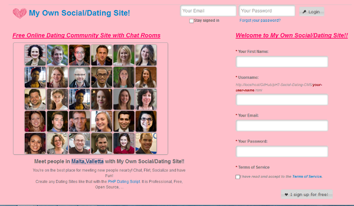

# DateLove - Dating Love Theme

## Overview

**DateLove** is a **Dating template** for [pH7 Social Dating CMS](http://ph7cms.com/pro). 

This template has been especially designed for Online Dating Site. 

First off, you have to install pH7CMS, then upload this template (datelove folder) into the 
*/templates/themes/* folder. After that, you can enable it in the [http://ph7cms.com/doc/en/how-to-go-to-admin-panel](admin panel), Settings -> General -> "Theme by default".

## Requirements

[pH7CMS](http://ph7cms.com) (it's the **Social Dating Site Builder**) + [pH7CMS's requirements](http://ph7cms.com/doc/en/requirements).

## Author

Pierre-Henry Soria

## Contact

By email at *pierrehenrysoria [[AT]] gmail [[D0T]] com* or at *hello [[AT]] ph7cms [[D0T]] com*

## License

[General Public License 3](http://www.gnu.org/licenses/gpl.html) or later; See the *PH7.LICENSE.txt* and *PH7.COPYRIGHT.txt* files for more details.
